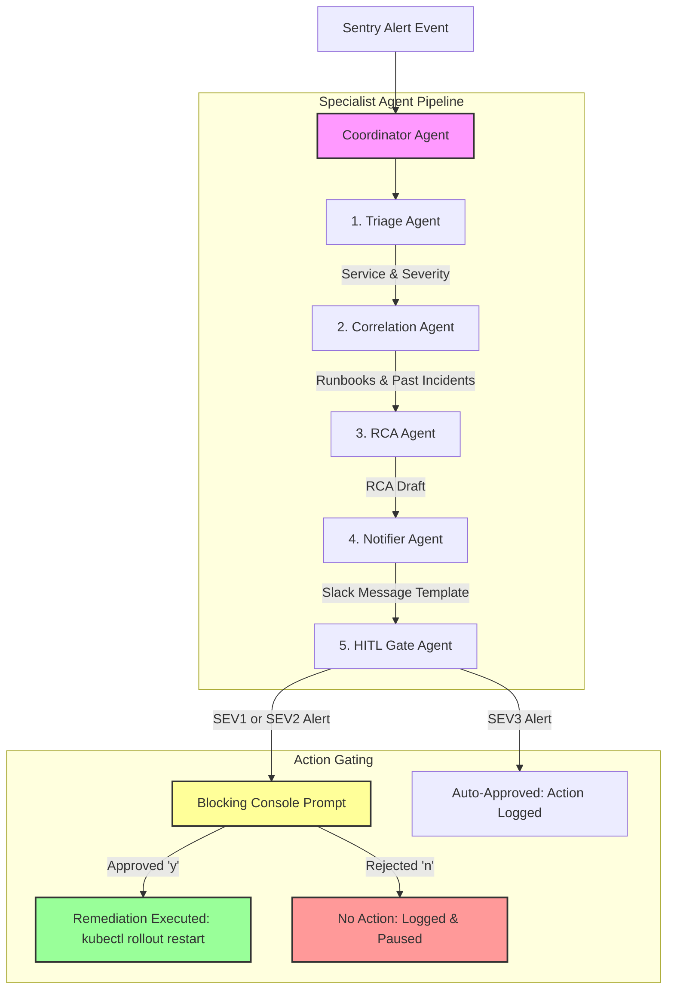

# SRE Incident Triage Agent - Architecture Documentation

This document provides a detailed overview of the system architecture, agent topology, integration points, and safety guardrails of the **SRE Incident Triage Agent** built for the Google AI Agents Capstone Project.

---

## 1. System Overview & Problem Statement

Production incidents in modern cloud environments often suffer from high **Time to Acknowledge (TTA)** and **Time to Resolution (TTR)**. SRE teams are inundated with alerts, many of which require repetitive diagnostic steps:
1. Identifying the affected service and severity.
2. Searching for corresponding runbooks.
3. Checking GitHub or Sentry for past occurrences.
4. Drafting a Root Cause Analysis (RCA).
5. Alerting the team on Slack.
6. Proposing and executing remediation commands.

The **SRE Incident Triage Agent** automates this entire lifecycle in under **30 seconds** (down from typical 15–20 minute manual efforts) using an autonomous multi-agent pipeline while keeping a human strictly in the loop for high-severity changes.

---

## 2. Agent Team Topology

The system uses the **ADK 2.0 Collaborative Teams** pattern. A central coordinator agent manages state and sequences data through five specialized sub-agents:

### Specialist Descriptions
1. **Coordinator Agent (`coordinator.py`):** The orchestrator. Coordinates the execution flow, transfers inputs/outputs between specialist agents, constructs the final incident card, and manages the execution timer.
2. **Triage Agent (`agents/triage_agent.py`):** Classifies the incident severity (`SEV1`, `SEV2`, `SEV3`) and parses metadata to locate the target `affected_service`.
3. **Correlation Agent (`agents/correlation_agent.py`):** Connects to external MCP servers to fetch documentation runbooks and search past GitHub issue logs for similar errors.
4. **RCA Agent (`agents/rca_agent.py`):** Uses alert details and runbook/past issue context to draft a structured, markdown-formatted Root Cause Analysis report.
5. **Notifier Agent (`agents/notifier_agent.py`):** Formats the diagnostic results and RCA summary into a production-ready Slack message template.
6. **HITL Gate Agent (`agents/hitl_gate.py`):** Acts as the safety guardrail. Checks the severity against configured settings and blocks execution on manual console confirmation (`y/n`) for high-severity actions.

---

## 3. Model Context Protocol (MCP) Integrations

To ensure grounded and hallucination-free diagnostics, the **Correlation Agent** communicates with three Model Context Protocol servers:

| MCP Server | Tool Invoked | Purpose |
|------------|--------------|---------|
| `google-developer-knowledge` | `search_documents` | Queries the official Google Cloud documentation corpus for runbooks relating to the alert service and error context. |
| `github` | `search_github_issues` | Scans the engineering organization's repository (`my-org/sre-runbooks`) for past closed issues matching the service and error keywords. |
| `sentry (Simulated)` | `get_sentry_event` | Fetches the full raw JSON payload of the alert by its event ID to extract the original traceback, level, and timestamp. |

---

## 4. Human-In-The-Loop (HITL) & The Trust Ladder

Remediation commands (such as running `kubectl rollout restart`) must never run completely unattended on critical production services. The system enforces a strict **HITL safety gate**:

*   **Dynamic Thresholding:** The threshold at which the pipeline blocks for human validation is configured via `hitl_threshold_severity` in `capstone/config.py` (which reads from environment variables, defaulting to `SEV2`).
*   **SEV1 & SEV2 Incidents (High Severity):** The pipeline halts, displays the diagnostic summaries, proposed actions, and asks the user for explicit input (`y/n`).
*   **SEV3 Incidents (Low Severity):** The action is logged and auto-approved without blocking, keeping low-priority adjustments fast and frictionless.

---

## 5. Telemetry & Observability

To track system health and latency, the pipeline integrates a mock OpenTelemetry-compliant telemetry adapter (`capstone/telemetry.py`):
*   **Span Logging:** Logs structured JSON records detailing the `operation` name, `inputs`, `outputs`, `span_id`, and `duration_ms`.
*   **Safety Isolation:** Telemetry logging runs in a global `try/except` block to guarantee that monitoring issues never crash the main incident response pipeline.
